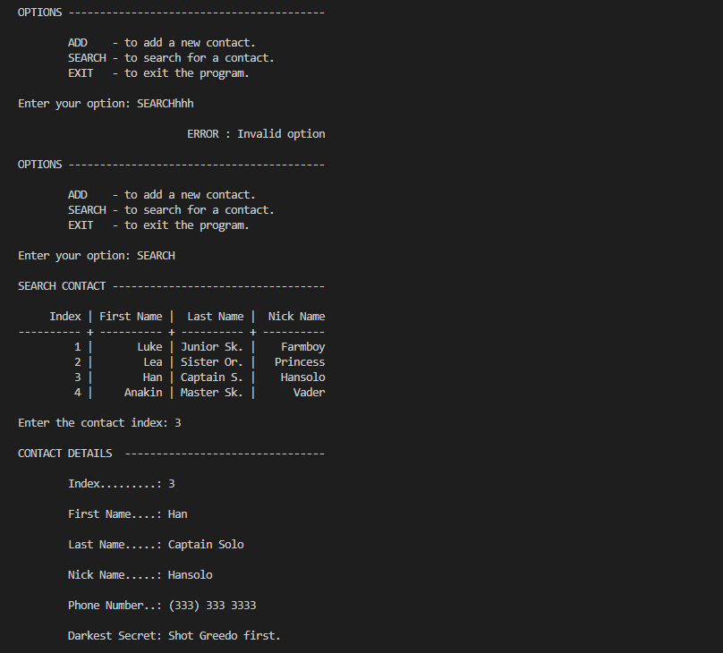

# 42 Berlin - Projects - CPP Module 00   

## 📖 Overview
This is the first project of the C++ track at 42 School. The primary focus is the transition from C's procedural mindset to Object-Oriented Programming (OOP), introducing fundamental concepts such as classes, namespaces, and I/O streams.   

## ✨ Key Features Learned
- Handling command-line arguments in a C++ environment.
- **Namespaces**: Understanding global scope and the use of the std:: prefix.   
- **I/O Streams**: Replacing printf/scanf with std::cout and std::cin.   
- **Classes and Encapsulation**: Defining classes with private members (data) and public members (behavior).   
- **Object Instantiation**: Creating and managing objects on the Stack.   
- **String Manipulation**: Using the std::string class instead of C-style char * arrays.   
- **Output Formatting**: Utilizing manipulators like std::setw and std::right to display data in aligned tables.

## Usage
1. Clone the repository:

2. Navigate to the exercise folder:
   ```sh
   cd ex00/
   ```

3. Build the project:
   ```sh
   make
   ```

4. Run the program:
   ```sh
   ./[executable_name]
   ```

## References
- [C++98 Standard Overview](https://en.wikipedia.org/wiki/C%2B%2B98)
- [cppreference - std::string](https://en.cppreference.com/w/cpp/string/basic_string)
- [C++ Static Members Documentation](https://www.google.com/search?q=https://learn.microsoft.com/en-us/cpp/cpp/static-members-cpp)

## 📸 Featured Exercise: [ex01](https://github.com/Tarcisio2code/42Berlin/tree/master/Projects/CPP-Modules/cpp00/ex01)

**Implementation Highlights:**
- **Formatting:** Used `std::setw` for precise tabular data alignment.
- **Validation:** Robust input checking using `std::getline` and buffer clearing.
- **Logic:** Circular buffer implementation to manage a maximum of 8 contacts.


