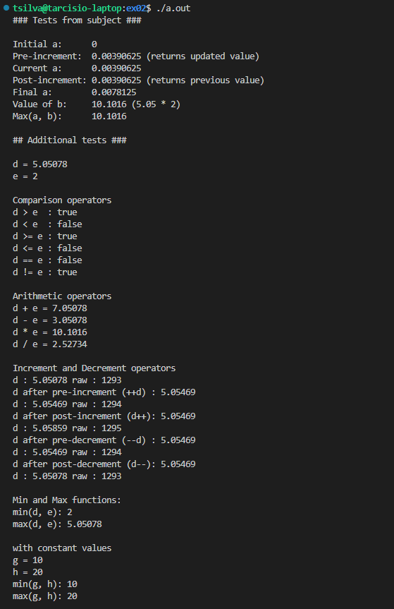

# 42 Berlin - Projects - CPP Module 02   

## 📖 Overview
This module introduces **Ad-hoc polymorphism**, **operator overloading**, and the **Orthodox Canonical Class Form**. The primary objective is to create a functional class that represents fixed-point numbers, providing a deeper understanding of how C++ handles custom types and mathematical operations.

## ✨ Key Features Learned
- **Orthodox Canonical Class Form**: Implementing the mandatory four pillars: Default Constructor, Copy Constructor, Copy Assignment Operator, and Destructor.
- **Fixed-Point Arithmetic**: Understanding the trade-offs between floating-point and fixed-point performance and precision.
- **Operator Overloading**: Customizing the behavior of comparison ($>$, $<$, $>=$, $<=$, $==$, $!=$), arithmetic ($+$, $-$, $*$, $/$), and increment/decrement ($++$, $--$) operators.
- **Ad-hoc Polymorphism**: Using function overloading to create versatile class methods.

## Usage
1. Clone the repository:

2. Navigate to the exercise folder:
   ```sh
   cd ex00/
   ```

3. Build the project:
   ```sh
   make
   ```

4. Run the program:
   ```sh
   ./[executable_name]
   ```

## References
- [Operator Overloading (cppreference)](https://en.cppreference.com/w/cpp/language/operators)
- [Fixed-Point Arithmetic (Wikipedia)](https://en.wikipedia.org/wiki/Fixed-point_arithmetic)
- [C++98 Standard (ISO/IEC 14882:1998)](https://en.wikipedia.org/wiki/C%2B%2B98)
- [Fixed Point Math Tutorial](https://www.digikey.com/en/articles/fixed-point-arithmetic-for-embedded-systems)
- [Arithmetic Operator Overloading](https://learn.microsoft.com/en-us/cpp/cpp/operator-overloading)

## 📸 Featured Exercise: [ex02](https://github.com/Tarcisio2code/42Berlin/tree/master/Projects/CPP-Modules/cpp02/ex02)

**Implementation Highlights:**
- **Comprehensive Overloading**: Full implementation of arithmetic and comparison operators for the Fixed class.
- **Precision Control**: Managing bit-shifting to handle conversions between integers, floats, and fixed-point values.
- **Static Member Functions**: Inclusion of min and max functions to compare fixed-point objects efficiently.


