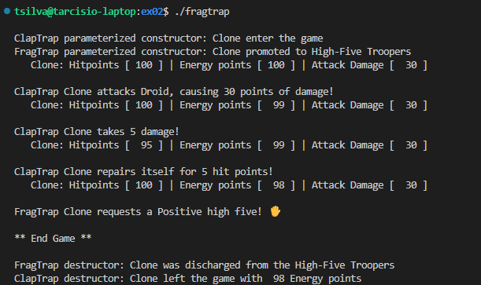

# 42 Berlin - Projects - CPP Module 03   

## 📖 Overview
This module introduces the concept of **Inheritance** in C++. The project follows the evolution of the "ClapTrap" entity into more specialized classes like "ScavTrap" and "FragTrap," culminating in the "DiamondTrap." The focus is on code reuse, shadowed member attributes, and solving the complexities of multiple inheritance.

## ✨ Key Features Learned
- **Base vs. Derived Classes**: Understanding the relationship between parent and child classes.  
- **Access Specifiers**: Properly using public, protected, and private to control data visibility across the inheritance chain.  
- **Constructor/Destructor Chaining**: Observing the specific order in which constructors and destructors are called in derived classes.  
- **The Diamond Problem**: Utilizing virtual inheritance to prevent duplicate base class instances in multiple inheritance scenarios.  
- **Method Overriding**: Redefining base class behaviors (like attack) to suit the specialized needs of derived classes.  

## Usage
1. Clone the repository:

2. Navigate to the exercise folder:
   ```sh
   cd ex00/
   ```

3. Build the project:
   ```sh
   make
   ```

4. Run the program:
   ```sh
   ./[executable_name]
   ```

## References
- [Inheritance in C++](https://www.geeksforgeeks.org/inheritance-in-c/)
- [Multiple Inheritance and the Diamond Problem](https://www.learncpp.com/cpp-tutorial/multiple-inheritance/)
- [Virtual Base Classes](https://www.ibm.com/docs/en/i/7.6.0?topic=only-virtual-base-classes-c)
- [C++98 Standard (ISO/IEC 14882:1998)](https://en.wikipedia.org/wiki/C%2B%2B98)

## 📸 Featured Exercise: [ex02](https://github.com/Tarcisio2code/42Berlin/tree/master/Projects/CPP-Modules/cpp03/ex02)

**Implementation Highlights:**
- **Class Extension**: Successfully derived FragTrap from the ClapTrap base class, inheriting attributes while defining new specialized behaviors.
- **Method Overriding**: Reimplemented the attack method to reflect FragTrap's unique combat style and higher damage output.
- **Specialized Functionality**: Implemented the highFivesGuys member function, demonstrating how derived classes can introduce entirely new capabilities not present in the parent class.
- **Chained Initialization**: Properly managed constructor and destructor sequences to ensure the base class is initialized before the derived class attributes.



