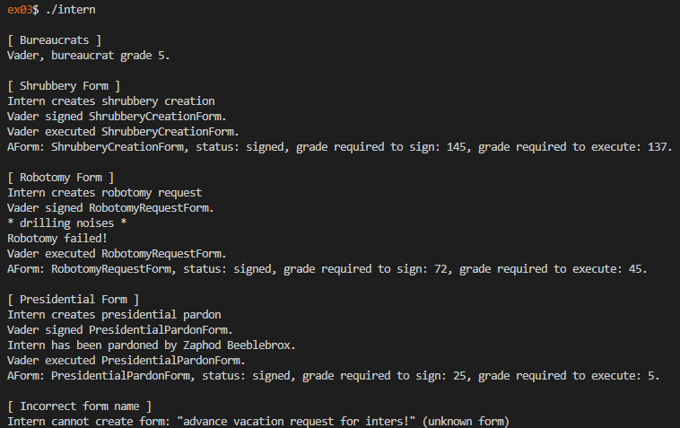

# 42 Berlin - Projects - CPP Module 05

## 📖 Overview

This module introduces **Exceptions** in C++ and demonstrates how they can be used to build robust and safe applications. Through a hierarchy of bureaucratic forms and government officials, the project explores exception handling, class interactions, and enforcing constraints through custom exception types.

## ✨ Key Features Learned

* **Exception Handling**: Using `try`, `catch`, and `throw` to manage runtime errors safely.
* **Custom Exceptions**: Creating specialized exception classes derived from `std::exception`.
* **Canonical Orthodox Form**: Implementing constructors, copy constructors, assignment operators, and destructors consistently.
* **Class Collaboration**: Designing interactions between multiple classes while maintaining encapsulation.
* **Validation & Constraints**: Enforcing business rules through exceptions instead of error codes.
* **Polymorphism with Exceptions**: Combining inheritance and exception handling for flexible object-oriented designs.

## Usage

1. Clone the repository:

2. Navigate to the exercise folder:

   ```sh
   cd ex00/
   ```

3. Build the project:

   ```sh
   make
   ```

4. Run the program:

   ```sh
   ./[executable_name]
   ```

## References

* https://en.cppreference.com/w/cpp/language/exceptions
* https://en.cppreference.com/w/cpp/error/exception
* https://www.geeksforgeeks.org/exception-handling-c/
* https://en.wikipedia.org/wiki/C%2B%2B98

## 📸 Featured Exercise: [ex03](https://github.com/Tarcisio2code/42Berlin/tree/master/Projects/CPP-Modules/cpp05/ex03)

**Implementation Highlights:**

* **Dynamic Form Creation**: Implemented an Intern class capable of creating different forms at runtime based on string requests.
* **Factory Pattern Concept**: Centralized object creation logic, reducing coupling between client code and concrete form types.
* **Exception Safety**: Handled invalid form requests gracefully by throwing and catching custom exceptions.
* **Polymorphic Form Hierarchy**: Managed multiple concrete forms through base class pointers while preserving runtime behavior.
* **Bureaucratic Workflow Simulation**: Combined Intern, Bureaucrat, and AForm classes into a complete signing and execution system.

_The module reinforces the importance of exception-driven design, demonstrating how errors can be handled cleanly while maintaining object-oriented principles and strong program reliability._


