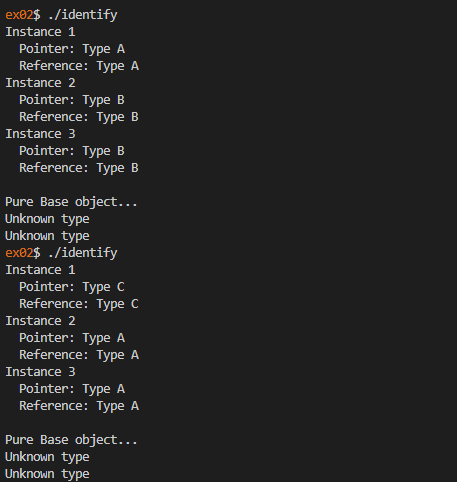

# 42 Berlin - Projects - CPP Module 06

## 📖 Overview

This module introduces **C++ Casts** and explores the different mechanisms available for type conversion in C++. Through practical exercises, the project demonstrates how casting can be used safely and effectively when working with inheritance hierarchies, low-level data manipulation, and runtime type identification.

## ✨ Key Features Learned

* **Scalar Type Conversion**: Converting between fundamental data types such as `char`, `int`, `float`, and `double`.
* **Static Cast**: Performing compile-time type conversions safely and explicitly.
* **Reinterpret Cast**: Converting pointers to different types and understanding low-level memory representation.
* **Dynamic Cast**: Identifying object types at runtime within polymorphic class hierarchies.
* **Serialization Concepts**: Transforming pointers into raw integer representations and restoring them.
* **Runtime Type Information (RTTI)**: Using polymorphism to determine an object's actual type during execution.

## Usage

1. Clone the repository:

2. Navigate to the exercise folder:

   ```sh
   cd ex00/
   ```

3. Build the project:

   ```sh
   make
   ```

4. Run the program:

   ```sh
   ./[executable_name]
   ```

## References

* https://en.cppreference.com/w/cpp/language/static_cast
* https://en.cppreference.com/w/cpp/language/dynamic_cast
* https://en.cppreference.com/w/cpp/language/reinterpret_cast
* https://en.cppreference.com/w/cpp/language/typeid
* https://en.wikipedia.org/wiki/Run-time_type_information
* https://en.wikipedia.org/wiki/C%2B%2B98

## 📸 Featured Exercise: [ex02](https://github.com/Tarcisio2code/42Berlin/tree/master/Projects/CPP-Modules/cpp06/ex02)

**Implementation Highlights:**

* **Runtime Type Identification**: Used `dynamic_cast` to determine the real type of objects through base class references and pointers.
* **Polymorphic Hierarchy**: Implemented a base class with multiple derived classes to demonstrate safe downcasting.
* **Pointer vs Reference Casting**: Explored the differences between failed casts returning `NULL` (pointers) and throwing exceptions (references).
* **Random Object Generation**: Created objects dynamically to validate type detection mechanisms.
* **RTTI in Practice**: Demonstrated how C++ can identify an object's actual type during runtime while preserving abstraction.

_This module provides a solid understanding of C++ casting operators and Runtime Type Information (RTTI), highlighting when type conversions are safe, when they are dangerous, and how to leverage polymorphism to write flexible and reliable software._



