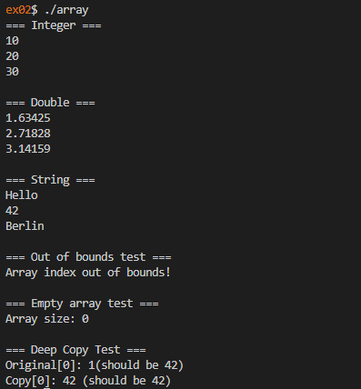

# 42 Berlin - Projects - CPP Module 07

## 📖 Overview

This module introduces **C++ Templates**, one of the most powerful features of the language. Templates enable generic programming by allowing functions and classes to operate with different data types without code duplication. The project focuses on creating reusable, type-independent components while preserving type safety and performance.

## ✨ Key Features Learned

* **Function Templates**: Writing generic functions that work with multiple data types.
* **Class Templates**: Creating reusable classes parameterized by type.
* **Generic Programming**: Designing algorithms independent of specific data types.
* **Template Instantiation**: Understanding how templates are generated at compile time.
* **Type Safety**: Leveraging compile-time checks while maintaining flexibility.
* **Code Reusability**: Eliminating duplication through generic implementations.

## Usage

1. Clone the repository:

2. Navigate to the exercise folder:

   ```sh
   cd ex00/
   ```

3. Build the project:

   ```sh
   make
   ```

4. Run the program:

   ```sh
   ./[executable_name]
   ```

## References

* https://en.cppreference.com/w/cpp/language/templates
* https://en.cppreference.com/w/cpp/language/class_template
* https://en.cppreference.com/w/cpp/language/function_template
* https://www.geeksforgeeks.org/templates-cpp/
* https://en.wikipedia.org/wiki/Template_(C%2B%2B)
* https://en.wikipedia.org/wiki/C%2B%2B98

## 📸 Featured Exercise: [ex02](https://github.com/Tarcisio2code/42Berlin/tree/master/Projects/CPP-Modules/cpp07/ex02)

**Implementation Highlights:**

* **Template Class Design**: Implemented a generic `Array<T>` class capable of storing any data type.
* **Dynamic Memory Management**: Managed memory allocation and deallocation safely within a templated context.
* **Deep Copy Support**: Implemented Copy Constructor and Assignment Operator to ensure independent array instances.
* **Bounds Checking**: Added exception handling to prevent invalid index access and improve reliability.
* **Type Independence**: Demonstrated how a single implementation can support multiple types without modification.
* **Exception Safety**: Combined templates and custom exceptions to build robust generic containers.

_This module demonstrates the foundations of generic programming in C++, showing how templates allow developers to create flexible, reusable, and type-safe components while maintaining the efficiency of compile-time code generation._


