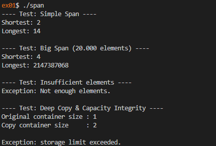
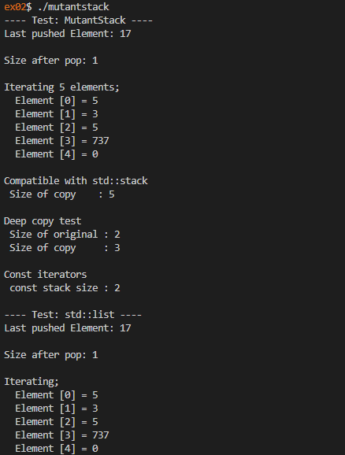

# 42 Berlin - Projects - CPP Module 08

## 📖 Overview
This module explores **STL containers**, **Iterators**, and **Template Metaprogramming** in C++. The project focuses on building generic utilities that work with standard containers and adapting existing container adapters to expose iterator-based behavior.

## ✨ Key Features Learned
- **Generic Algorithms**: Writing a template function (`easyfind`) that searches any container supporting iterators.
- **Iterator Access on Container Adapters**: Extending `std::stack` with `MutantStack` to expose `begin()` / `end()` for stack traversal.
- **Exception Safety**: Throwing and handling exceptions for missing elements or invalid operations.
- **Bulk Range Insertion**: Using iterator ranges to efficiently add many elements at once in `Span`.
- **Span Calculations**: Computing `shortestSpan()` and `longestSpan()` from a dynamic container of integers.

## Usage
1. Clone the repository:

2. Navigate to the exercise folder:
   ```sh
   cd ex00/
   ```

3. Build the project:
   ```sh
   make
   ```

4. Run the program:
   ```sh
   ./[executable_name]
   ```

## References
- [STL Iterators](https://en.cppreference.com/w/cpp/iterator)
- [std::stack](https://en.cppreference.com/w/cpp/container/stack)
- [std::vector](https://en.cppreference.com/w/cpp/container/vector)
- [std::find](https://en.cppreference.com/w/cpp/algorithm/find)
- [C++ Templates](https://en.cppreference.com/w/cpp/language/templates)

## 📸 Featured Exercise: 
[ex01](https://github.com/Tarcisio2code/42Berlin/tree/master/Projects/CPP-Modules/cpp08/ex01)

**Implementation Highlights:**
- **Generic Search Utility**: `easyfind` is implemented as a template function over any container type that provides iterators, allowing reuse across arrays, vectors, lists, and more.
- **Iterator-Enabled Stack**: `MutantStack` inherits from `std::stack` and exposes the underlying container iterators, merging stack semantics with iterable behavior.
- **Efficient Bulk Insertion**: `Span::addRangeOfNumbers()` uses iterator-range insertion and a capacity check before inserting, which is both idiomatic and more efficient than inserting elements one-by-one.
- **Strong Exception Contracts**: The code clearly signals failure conditions like `CapacityExceeded` and `NoElements`, improving robustness in edge cases.

[ex02](https://github.com/Tarcisio2code/42Berlin/tree/master/Projects/CPP-Modules/cpp08/ex02)

**Implementation Highlights:**

* **STL Container Adapters**: Demonstrated how `std::stack` internally relies on an underlying container such as `std::deque`.
* **Container Compatibility**: Maintained full compatibility with existing stack operations like `push()`, `pop()`, `top()`, and `size()`.
* **Generic Implementation**: Preserved template-based flexibility, allowing the stack to store any supported type.
* **STL Understanding**: Showcased how container adapters and iterators interact within the Standard Template Library.

_This module reinforces the use of the Standard Template Library by demonstrating how containers, iterators, and generic programming concepts work together to create efficient, reusable, and maintainable C++ applications._

<p align="center">
  
  
</p>