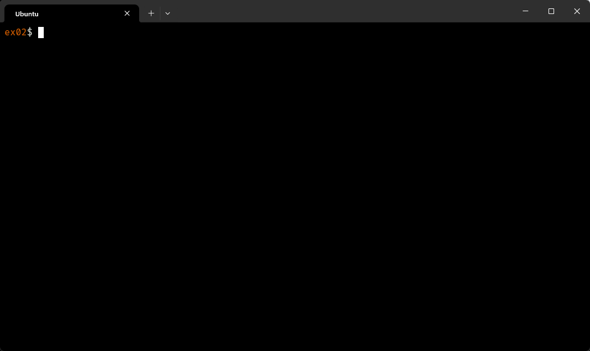

# 42 Berlin - Projects - CPP Module 09

## 📖 Overview

This module focuses on **STL (Standard Template Library)** containers and algorithms in C++98. Through three exercises of increasing complexity, it explores how the right container choice dramatically impacts performance, and culminates in a full implementation of the **Ford-Johnson Merge-Insertion Sort** — one of the most comparison-efficient sorting algorithms ever devised.

## ✨ Key Features Learned

- **STL Containers in Practice**: Hands-on use of `std::vector`, `std::deque`, `std::map`, `std::stack`, and `std::list` — understanding not just how they work, but *when* to use each.
- **Algorithm Complexity Awareness**: Selecting the appropriate container for a given problem based on access patterns, insertion cost, and cache behavior.
- **Reverse Polish Notation (RPN)**: Implementing a stack-based expression evaluator that parses and solves postfix arithmetic expressions.
- **Ford-Johnson Algorithm**: Implementing a theoretically optimal sorting algorithm using Jacobsthal numbers to minimize comparisons during binary insertion.
- **Template-Aware Design**: Writing sort logic for multiple container types while understanding the trade-offs between `std::vector` and `std::deque`.
- **Performance Benchmarking**: Measuring and comparing execution time across containers using `std::clock`.

## Usage

1. Clone the repository.
2. Navigate to the exercise folder:
   ```sh
   cd ex02/
   ```
3. Build the project:
   ```sh
   make
   ```
4. Run the program:
   ```sh
   ./PmergeMe 3 5 9 7 4 1 8 2 6
   ```

**Expected output:**
```
Before: 3 5 9 7 4 1 8 2 6
After:  1 2 3 4 5 6 7 8 9
Time to process a range of 9 elements with std::vector : 0.000021 us
Time to process a range of 9 elements with std::deque  : 0.000018 us
```

## References

- [Ford-Johnson Algorithm (Merge-Insertion Sort)](https://en.wikipedia.org/wiki/Merge-insertion_sort)
- [Jacobsthal Numbers](https://en.wikipedia.org/wiki/Jacobsthal_number)
- [STL Containers Overview](https://en.cppreference.com/w/cpp/container)
- [Binary Search with std::lower_bound](https://en.cppreference.com/w/cpp/algorithm/lower_bound)
- [C++98 Standard (ISO/IEC 14882:1998)](https://en.wikipedia.org/wiki/C%2B%2B98)

---

## 📸 Featured Exercise: [ex02 — PmergeMe](https://github.com/Tarcisio2code/42Berlin/tree/master/Projects/CPP-Modules/cpp09/ex02)

### The Ford-Johnson Merge-Insertion Sort

Ford-Johnson is not just another sorting algorithm — it is the sorting algorithm that for decades held the record for the **minimum number of comparisons** needed to sort *n* elements. The challenge of ex02 is to implement it correctly for two different STL containers and demonstrate measurable performance differences between them.

**Implementation Highlights:**

- **Pair-Based Divide & Conquer**: The input is divided into pairs; within each pair the larger element is identified in a single comparison. This guarantees that the entire first phase uses only ⌊n/2⌋ comparisons — the theoretical minimum for this step.

- **Recursive Main Chain Construction**: Only the larger elements of each pair are recursively sorted, building a sorted `mainChain`. The smaller partners (the *pend* sequence) are deferred — they will be binary-inserted later at a guaranteed bounded search range.

- **Jacobsthal-Ordered Insertion**: Rather than inserting pend elements left-to-right, they are inserted following the **Jacobsthal sequence** (Jₙ = Jₙ₋₁ + 2·Jₙ₋₂). This ordering is the mathematical core of Ford-Johnson: each insertion shrinks the upper-bound search range so that every binary search costs at most ⌈log₂(n)⌉ comparisons — the provably optimal strategy.

- **Bounded Binary Search via Pair Linkage**: Each pend element is linked to its larger partner still present in `mainChain`. The binary search for insertion is bounded *not* to the full chain, but only up to the position of that partner — cutting the search space in half and reducing wasted comparisons.

- **Leftover Handling**: When the input has an odd number of elements, the unpaired element is stored aside and only binary-inserted at the very end of the fully-sorted chain, never inflating the comparison count of earlier steps.

- **Dual-Container Implementation**: The full algorithm is independently implemented for both `std::vector` and `std::deque`, allowing direct benchmarking. `std::vector`'s contiguous memory layout gives it an edge in binary search (better cache locality), while `std::deque` performs more competitively on front insertions — making the timing comparison a genuine study in real-world container trade-offs, not just theoretical complexity.

- **Input Validation**: Every argument is validated with `std::strtol`, rejecting negative numbers, non-integer strings, and values exceeding `INT_MAX` before any sorting begins.


