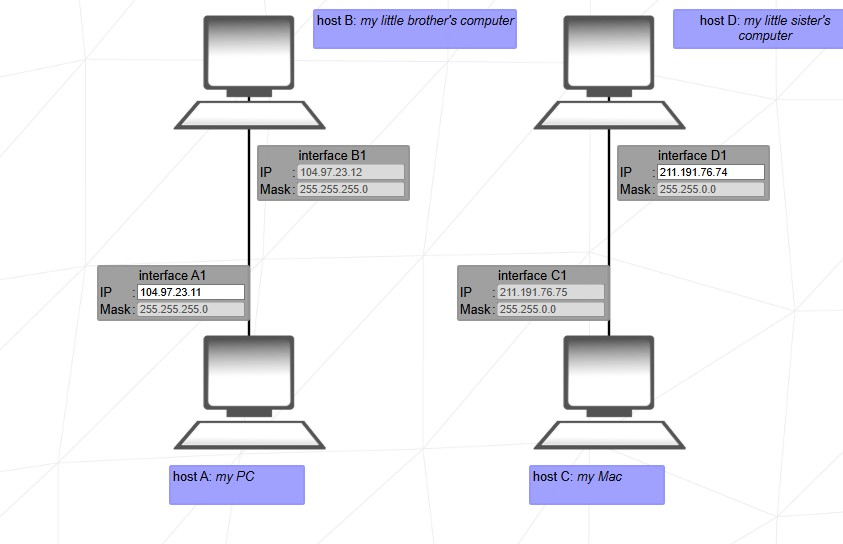
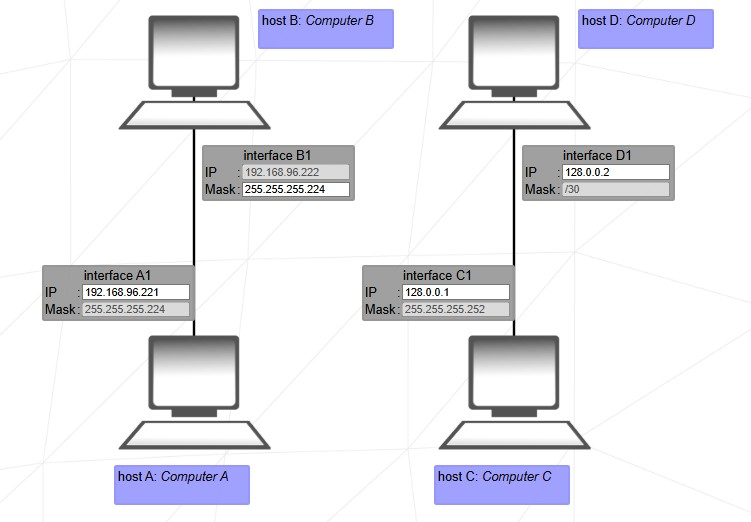
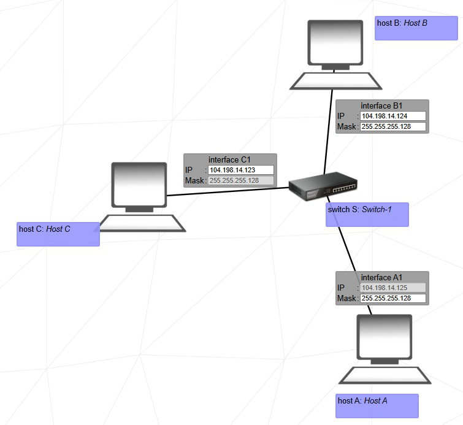
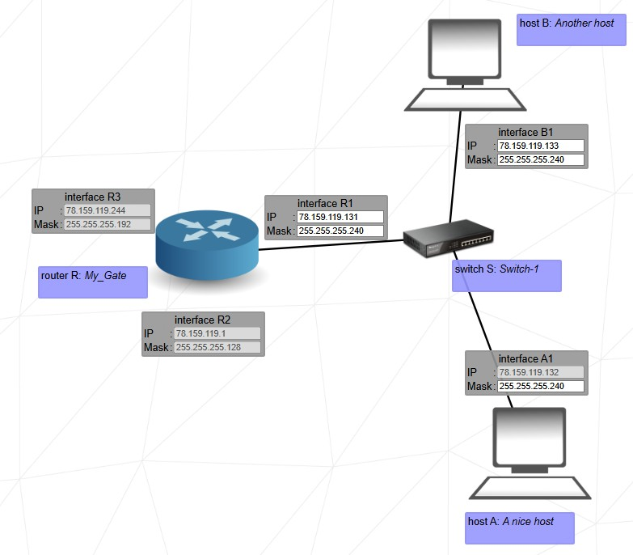
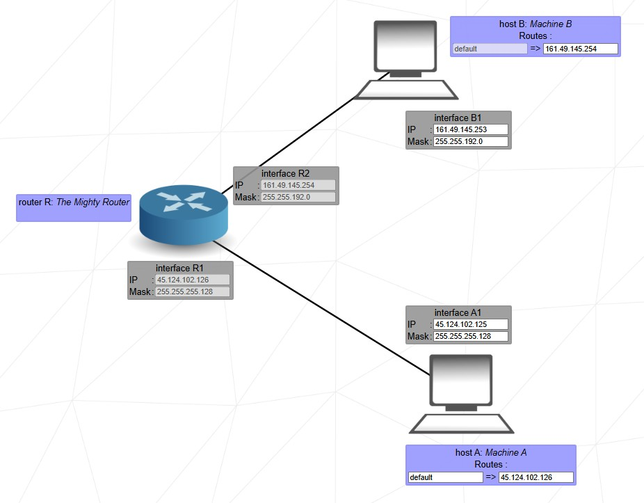
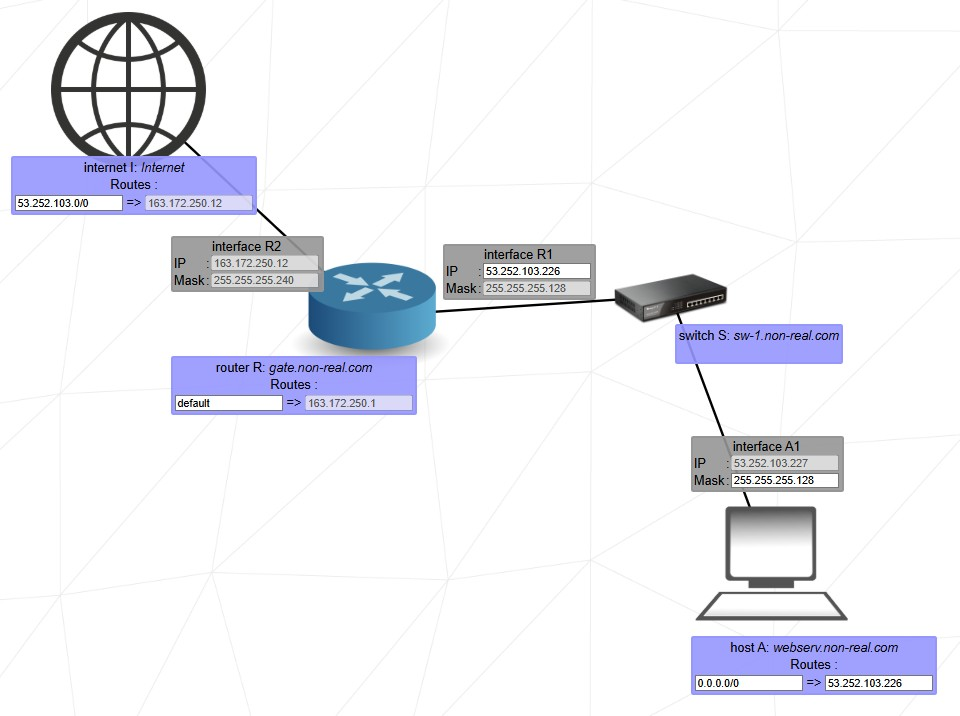
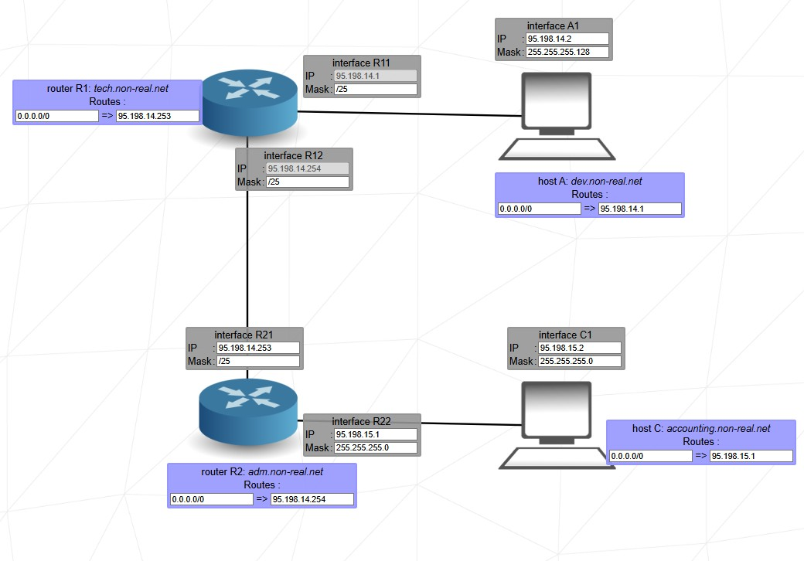
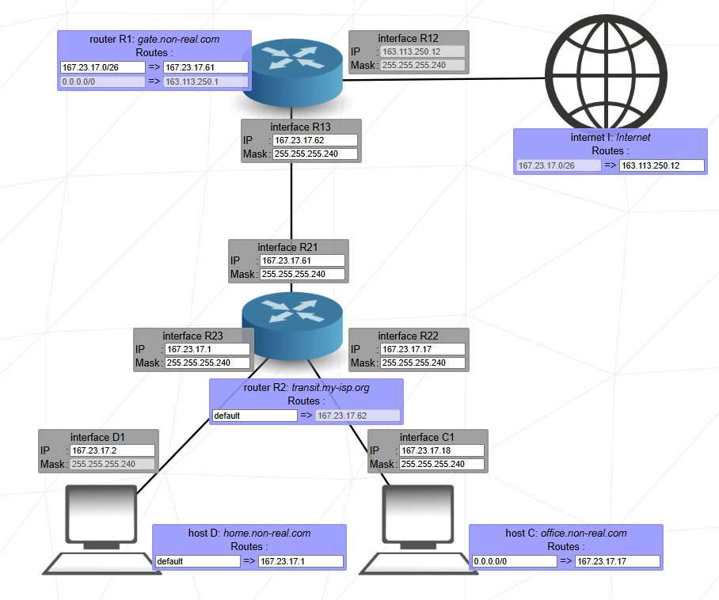
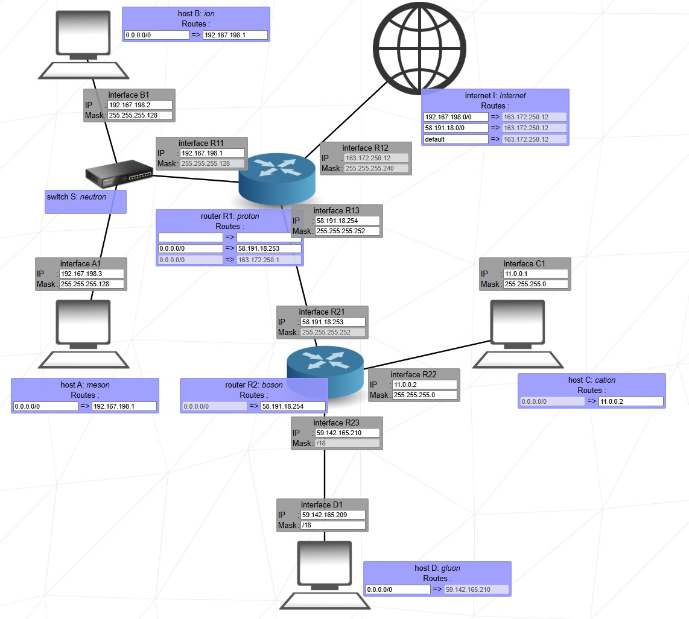
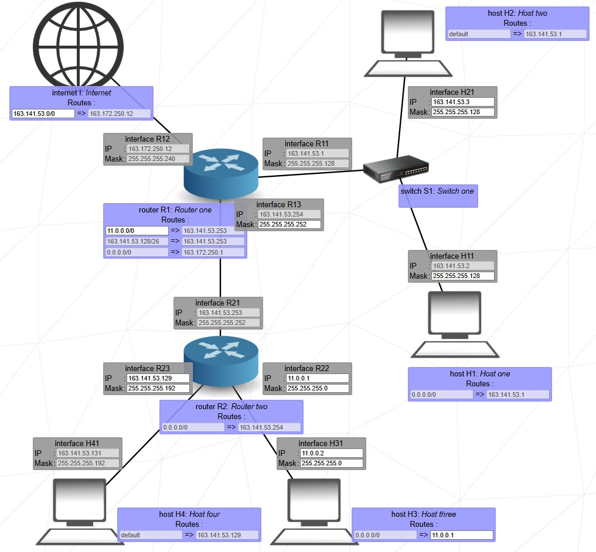

# 🛠️ NetPractice - Solutions Guide

> Personal walkthrough of all NetPractice levels and the networking concepts learned during the project.

---

<details>
<summary><strong>Level 1 — Basic IP Addressing</strong></summary>

### Objective

Understand that devices communicating on the same network must use valid IP addresses.

### Network Diagram

```text
+-----------+-------------------+-----------+
| Machine A |                   | Machine B |
+-----------+-------------------+-----------+

104.97.23.11                 211.191.76.74
```

### Solution

```text
A1 = 104.97.23.11
D1 = 211.191.76.74
```

### What I Learned

* IPv4 addresses uniquely identify hosts.
* Valid addressing is required for communication.
* Hosts cannot use network or broadcast addresses.

### Original Topology



</details>

---

<details>
<summary><strong>Level 2 — Network Membership</strong></summary>

### Objective

Determine whether devices belong to the same subnet.

### Solution

```text
A1 = 192.168.96.221
B1 = 255.255.255.224

C1 = 128.0.0.1
D1 = 128.0.0.2
```

### What I Learned

* The subnet mask defines network boundaries.
* Devices communicate directly only within the same subnet.

### Original Topology



</details>

---

<details>
<summary><strong>Level 3 — Introduction to Subnetting</strong></summary>

### Objective

Understand how subnet masks divide networks.

### Solution

```text
A1 = 255.255.255.128

B1 = 104.198.14.124
     255.255.255.128

C1 = 104.198.14.123
```

### What I Learned

* `/25` divides a `/24` network into two subnets.
* Host ranges must be respected.

### Key Concept

```text
/24 -> 254 hosts

Split into

/25 -> 126 hosts
/25 -> 126 hosts
```

### Original Topology



</details>

---

<details>
<summary><strong>Level 4 — Router Interface Configuration</strong></summary>

### Objective

Configure router interfaces inside the correct subnet.

### Solution

```text
A1 = 255.255.255.240

B1 = 78.159.119.133
     255.255.255.240

R1 = 78.159.119.131
     255.255.255.240
```

### What I Learned

* Routers connect networks.
* Router interfaces must belong to the same subnet as connected hosts.

### Original Topology



</details>

---

<details>
<summary><strong>Level 5 — Default Gateway</strong></summary>

### Objective

Configure gateways to reach remote networks.

### Solution

```text
Machine A

IP      : 45.124.102.125
Mask    : 255.255.255.128
Gateway : 45.124.102.126
```

```text
Machine B

IP      : 161.49.145.253
Mask    : 255.255.192.0
Gateway : 161.49.145.254
```

### What I Learned

* Hosts know only their local network.
* The gateway is used to reach remote networks.

### Original Topology



</details>

---

<details>
<summary><strong>Level 6 — Router to Internet</strong></summary>

### Objective
Configure a host, a router, and routing tables so the local network can communicate with the internet.

### Solution

```text
Host A
IP      : 53.252.103.x        (any valid host in 53.252.103.128/25)
Mask    : 255.255.255.128
Gateway : 53.252.103.226
```

```text
Router R — Interface R1 (LAN side)
IP      : 53.252.103.226
Mask    : 255.255.255.128
```

```text
Router R — Routing Table
Rr1 route : 0.0.0.0/0         (default route to internet)
```

```text
Internet Routing Table
Ir1 route : 53.252.103.128/25  (route back to the LAN subnet)
Ir1 gate  : <internet gateway ending in .12>
```

```text
Host A Routing Table
Ar1 route : 0.0.0.0/0
Ar1 gate  : 53.252.103.226
```

### Key Decisions
- Subnet `53.252.103.128/25` — mask `/25` gives 126 usable hosts in the `.128–.254` range; R1's LAN IP `.226` and Host A's IP must both fall in this range.
- The internet routing entry must point back to the LAN subnet so return traffic can reach Host A.
- The router itself only needs a default route (`0.0.0.0/0`) on its internet-facing side.

### What I Learned
- A router separates the LAN from the internet; each side is a different network.
- The internet needs a specific route back to your subnet — it does not discover it automatically.
- Default routes (`0.0.0.0/0`) are used when no more specific route matches.

### Original Topology


</details>

---

<details>
<summary><strong>Level 7 — Multiple routers</strong></summary>

### Objective
Connect two hosts (A and C) through two routers (R1 and R2), each host on its own subnet with a third subnet linking the two routers.

### Solution

```text
Host A
IP      : 95.198.14.2
Mask    : 255.255.255.128      (/25)
Gateway : 95.198.14.1
```

```text
Host C
IP      : 95.198.15.2
Mask    : 255.255.255.0        (/24)
Gateway : 95.198.15.1
```

```text
Router R1
R11 IP   : 95.198.14.1         (facing Host A — locked final .1)
R11 Mask : /25
R12 IP   : 95.198.14.254       (facing R2 — locked final .254)
R12 Mask : /25
Route    : 0.0.0.0/0  via 95.198.14.253
```

```text
Router R2
R21 IP   : 95.198.14.253
R21 Mask : /25
R22 IP   : 95.198.15.1
R22 Mask : 255.255.255.0
Route    : 0.0.0.0/0  via 95.198.14.254
```

### Key Decisions
- Three distinct subnets are required:
  - `95.198.14.0/25` — Host A ↔ R1 (R11)
  - `95.198.14.128/25` — R1 (R12) ↔ R2 (R21): both `.254` and `.253` fall here ✓
  - `95.198.15.0/24` — R2 (R22) ↔ Host C
- R12 and R21 form the inter-router link; they must share the same subnet and mask.
- Both routers use a default route pointing to each other for full connectivity.

### What I Learned
- Routers need an IP on every subnet they connect to.
- The link between two routers is itself a subnet — both endpoints need compatible IPs and masks.
- Default routes on both routers allow bidirectional traffic without listing every destination.

### Original Topology


</details>

---

<details>
<summary><strong>Level 8 — Static routing</strong></summary>

### Objective
Connect hosts C and D through two routers (R1 and R2) and the internet, using tight /28 subnets throughout.

### Solution

```text
Host C
IP      : 167.23.17.18
Mask    : 255.255.255.240      (/28 → range .17–.30)
Gateway : 167.23.17.17
```

```text
Host D
IP      : 167.23.17.2
Mask    : 255.255.255.240      (/28 → range .1–.14)
Gateway : 167.23.17.1
```

```text
Router R2
R21 IP   : 167.23.17.61        (inter-router link)
R21 Mask : 255.255.255.240
R22 IP   : 167.23.17.17        (facing Host C)
R22 Mask : 255.255.255.240
R23 IP   : 167.23.17.1         (facing Host D)
R23 Mask : 255.255.255.240
Route    : default             (R2r1 — to internet via R1)
```

```text
Router R1
R13 IP   : 167.23.17.62        (inter-router link)
R13 Mask : 255.255.255.240
R12      : (locked — internet-facing interface)
Route r2 : 167.23.17.0/26  via 167.23.17.61
Route r3 : (default — to internet)
```

```text
Internet Routing Table
Ir1 gate  : 163.113.250.12     (locked)
```

### Key Decisions
- `/28` means 16 addresses per subnet (14 usable). All interfaces use `255.255.255.240`.
- Four distinct /28 subnets:
  - `.0/28` — Host D ↔ R2 (R23)
  - `.16/28` — Host C ↔ R2 (R22)
  - `.48/28` — R2 (R21) ↔ R1 (R13): `.61` and `.62` are both in `.48–.62` ✓
  - R1's internet-facing interface is on a separate subnet (locked).
- R1r2 uses the aggregate route `167.23.17.0/26` to cover both host subnets in one entry.

### What I Learned
- A single router interface can have multiple downstream subnets reachable via one aggregate route.
- `/26` covers four `/28` blocks — route aggregation reduces table entries.
- Always verify that two IPs on a "link" subnet actually fall within the same /28 range.

### Original Topology


</details>

---

<details>
<summary><strong>Level 9 — Advanced routing</strong></summary>

### Objective
Connect four hosts (A, B, C, D) across two routers and the internet, each group on its own subnet.

### Solution

```text
Host A
IP      : 192.167.198.3
Mask    : 255.255.255.0
Gateway : 192.167.198.1
```

```text
Host B
IP      : 192.167.198.2
Mask    : 255.255.255.0        (corrected from /16 — must match Host A's subnet)
Gateway : 192.167.198.1
```

```text
Host C
IP      : 11.0.0.1
Mask    : 255.255.255.0
Gateway : 11.0.0.2
```

```text
Host D
IP      : 59.142.165.209
Mask    : /18
Gateway : 59.142.165.210
```

```text
Router R1
R11 IP   : 192.167.198.1       (facing A & B — locked)
R11 Mask : 255.255.255.0       (locked)
R13 IP   : 58.191.18.254       (facing R2)
R13 Mask : 255.255.255.240
Route r2 : 0.0.0.0/0  via 58.191.18.253
```

```text
Router R2
R21 IP   : 58.191.18.253
R21 Mask : 255.255.255.240     (locked)
R22 IP   : 11.0.0.2
R22 Mask : 255.255.255.0
R23 IP   : 59.142.165.210
Route r1 : 0.0.0.0/0  via 58.191.18.254
```

```text
Internet Routing Table
Ir1 route : 192.167.198.0/24   (to reach A & B — locked final .12 gateway)
Ir2 route : 58.191.18.0/28     (to reach the R1–R2 link subnet)
Ir3 route : default
```

### Key Decisions
- Host B's mask must be `/24` (not `/16`) to share the `192.167.198.0/24` subnet with Host A.
- The R1–R2 link uses `58.191.18.240/28` — both `.253` and `.254` fall in `.241–.254` ✓
- Host D and R23 share the `/18` subnet (`59.128.0.0/18`): `.209` and `.210` are adjacent ✓
- The internet needs explicit routes back to internal subnets; hosts C and D reach each other via R2.

### What I Learned
- All hosts on the same switch must share the exact same subnet mask — a mismatch breaks communication even if IPs appear compatible.
- With multiple routers, each router needs a route to every remote subnet (or a default route).
- The internet routing table models how real ISPs need return routes configured.

### Original Topology


</details>

---

<details>
<summary><strong>Level 10 — Full topology analysis</strong></summary>

### Objective
Connect four hosts (H1–H4) through two routers and the internet, with each pair of hosts on a carefully sized subnet.

### Solution

```text
Host H1   (locked — not exported)
Mask    : 255.255.255.128      (/25)
Subnet  : 163.141.53.0/25     (range .1–.126; must match H2)
```

```text
Host H2   (fully locked)
IP      : 163.141.53.3
Mask    : 255.255.255.128      (/25)
```

```text
Host H3
IP      : 11.0.0.2
Mask    : 255.255.255.0
Gateway : 11.0.0.1
```

```text
Host H4   (fully locked)
Subnet  : 163.141.53.128/26   (must match R23)
```

```text
Router R1
R11      : (locked — facing H1/H2, ip & mask locked)
R12      : (locked — ip & mask locked)
R13 IP   : (locked — inter-router link, /30)
R13 Mask : 255.255.255.252     (/30 → only 2 usable host IPs)
Route r1 : 11.0.0.0/24        (to H3's subnet via R2)
Route r2 : (default — to internet)
Route r3 : (default — to internet)
```

```text
Router R2   (fully locked)
R21      : (locked)
R22 IP   : 11.0.0.1
R22 Mask : 255.255.255.0
R23 IP   : 163.141.53.129
R23 Mask : 255.255.255.192     (/26 → range .129–.190; H4 must be here)
```

```text
Internet Routing Table
Ir1 route : 163.141.53.0/25   (locked final .12 gateway)
```

### Key Decisions
- H1 and H2 share `163.141.53.0/25` — H1's IP must be in `.1–.126` ≠ `.3`.
- H4 must be in `163.141.53.128/26` (`.129–.190`) to be on the same subnet as R23 (`.129`).
- R1–R2 inter-router link uses `/30` (mask `255.255.255.252`) — the tightest practical subnet for a point-to-point link (only 2 host IPs).
- R1r1 routes `11.0.0.0/24` via R2 so R1 can reach Host H3 on the other side.
- Internet only needs a route to `163.141.53.0/25` since H3 is reached through R2 internally.

### What I Learned
- `/30` point-to-point links are standard practice for router-to-router connections — they waste no IPs.
- Two hosts on the same switch can be on *different* subnets if connected through a router (H1/H2 on /25, H4 on /26 via R23).
- When a router interface is locked, you must infer the subnet from the given IP and design the rest of the topology around it.

### Original Topology


</details>

---

# 🎓 Final Lessons Learned

## Addressing & Subnetting

* IPv4 Addressing
* CIDR Notation
* Network Boundaries
* Host Ranges

## Routing

* Default Routes
* Static Routes
* Multi-Hop Routing
* Router Interfaces

## Troubleshooting

* Route Analysis
* Gateway Validation
* End-to-End Connectivity
* Network Design
