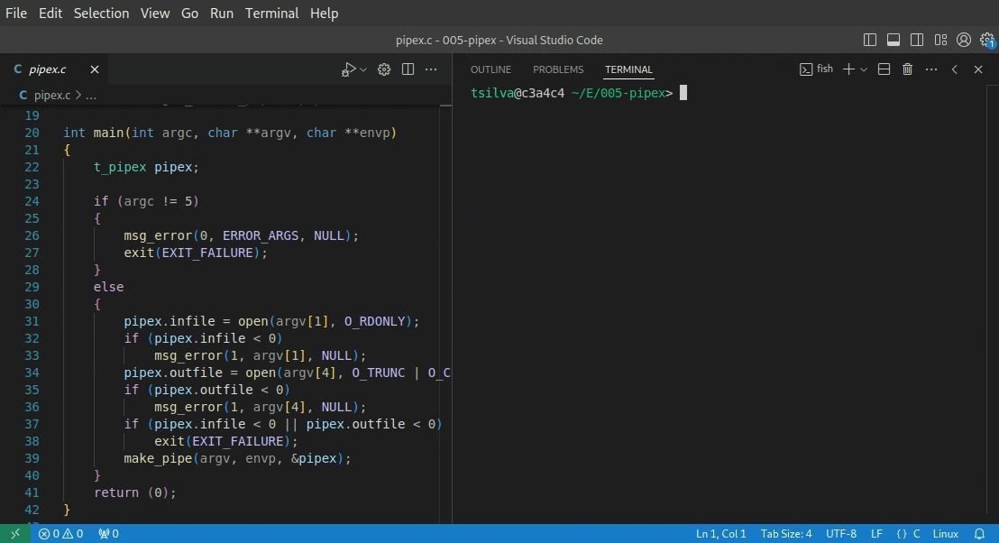

# 42 Berlin - Projects - Pipex

## Overview
Pipex is a program that simulates the functionality of the shell pipe (`|`). It allows executing two commands in sequence, passing the output of the first command as input to the second, similar to `command1 | command2`. The program uses system calls to create pipes, handle file descriptors, and execute commands via the `execve()` function.

## Summary
Pipex is written in C, and leverages several standard libraries and system functions to perform inter-process communication (IPC) using pipes. The key technologies and libraries used include:
- **System Calls**: `pipe()`, `fork()`, `dup2()`, `execve()`, `waitpid()`
- **File Descriptors and I/O Redirection**: `open()`, `close()`, `dup2()`
- **Error Handling**: `errno`, `perror()`
- **Libft**: Custom utility functions from the `libft` library for string manipulation, memory allocation, etc.

## Key Features Learned
- **Process Creation and Management**: The use of `fork()` to create child processes, and `waitpid()` to wait for process completion was a critical learning experience.
- **Pipes and IPC**: Implementing pipes to pass data between processes (using `pipe()`) and redirecting input/output streams with `dup2()` deepened understanding of process communication in Unix-like systems.
- **Error Handling**: Properly handling errors and ensuring all resources (e.g., file descriptors, memory) are cleaned up was emphasized.
- **File I/O**: The program handles opening, closing, and writing to files using the `open()`, `close()`, and file permission flags (`O_RDONLY`, `O_TRUNC`, `O_CREAT`, `O_RDWR`).

## Usage
The Pipex program is executed as follows:

./pipex infile "command1" "command2" outfile

- `infile`: The input file whose contents are passed to `command1`.
- `command1`: The first command to be executed.
- `command2`: The second command that receives the output of `command1` as input.
- `outfile`: The output file that stores the result of `command2`.

For example:
./pipex input.txt "cat -e" "wc -l" output.txt

This command will execute `cat -e` on `input.txt` and pass the result to `wc -l`, writing the final output to `output.txt`.

## Important System Calls and Functions
Here are some key system functions used in Pipex:

1. **fork()**: Creates a child process.
   - [Fork in Unix](https://man7.org/linux/man-pages/man2/fork.2.html)
   
2. **pipe()**: Creates a unidirectional data channel (pipe).
   - [Pipe System Call](https://man7.org/linux/man-pages/man2/pipe.2.html)

3. **dup2()**: Duplicates a file descriptor for redirection.
   - [dup2 in Unix](https://man7.org/linux/man-pages/man2/dup2.2.html)

4. **execve()**: Executes a program in the context of the current process.
   - [Execve System Call](https://man7.org/linux/man-pages/man2/execve.2.html)

5. **open() and close()**: Open and close file descriptors.
   - [Open System Call](https://man7.org/linux/man-pages/man2/open.2.html)

6. **waitpid()**: Waits for a child process to terminate.
   - [Waitpid Function](https://man7.org/linux/man-pages/man2/waitpid.2.html)

7. **perror() and strerror()**: Handle error messages based on `errno`.
   - [Perror Function](https://man7.org/linux/man-pages/man3/perror.3.html)

## References
- [Linux Pipes and I/O Redirection](https://tldp.org/LDP/lpg/node11.html)
- [Fork and Exec: Process Creation](https://www.gnu.org/software/libc/manual/html_node/Processes.html)
- [Introduction to Unix I/O](https://www.geeksforgeeks.org/input-output-system-calls-c-create-open-close-read-write/)
- [Man Pages for Linux System Calls](https://man7.org/linux/man-pages/)    
    

