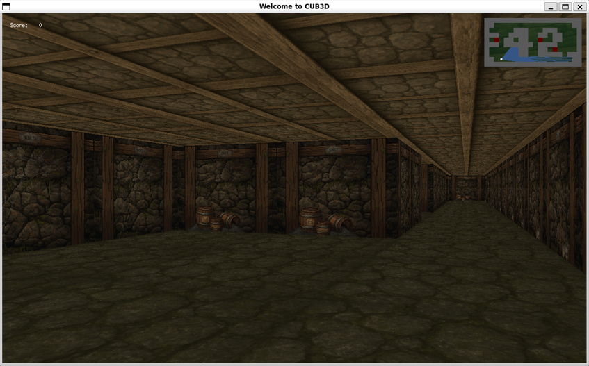
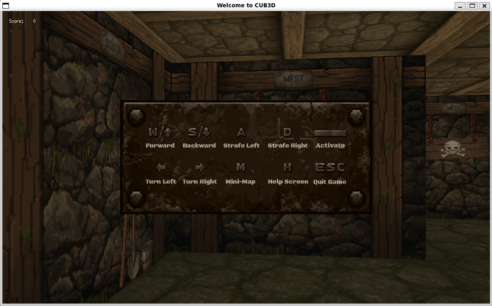
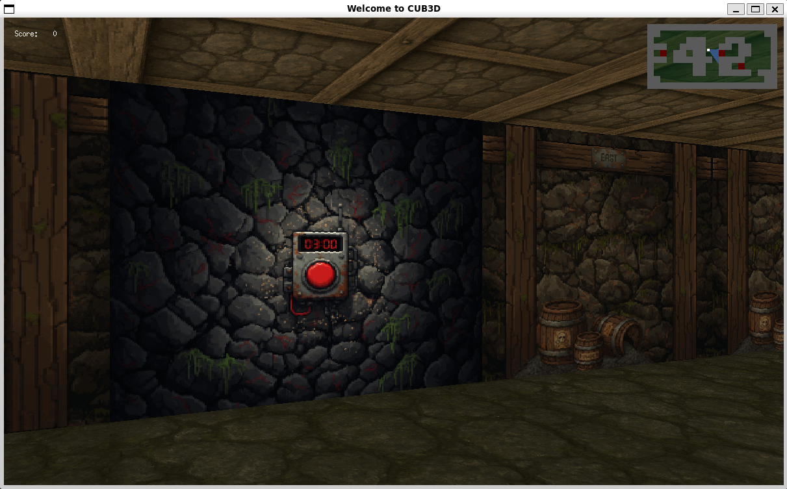
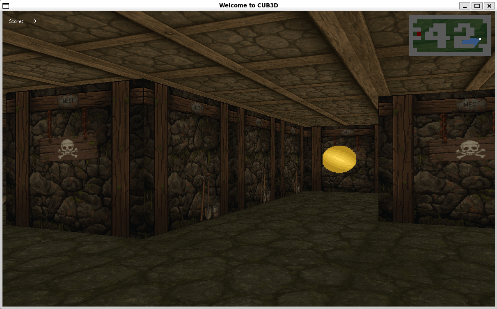
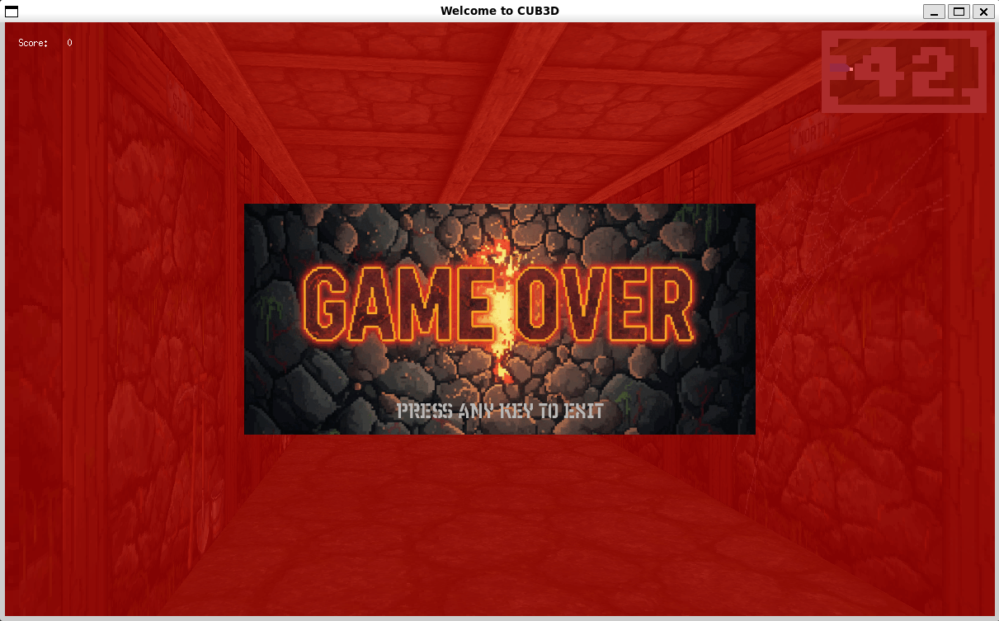

# 42 Berlin - Projects - 🧱 Cub3D


## 📖 Overview
     

**Cub3D** is one of the most iconic projects of the 42 curriculum. Inspired by the original **Wolfenstein 3D**, the objective is to build a complete first-person rendering engine using **raycasting**, without relying on any existing 3D engine.

This implementation goes beyond the mandatory requirements by including animated collectibles, interactive objects, HUD, minimap, help screen and game over effects.

## 📚 Summary

Cub3D introduces the fundamentals of computer graphics and game engine architecture.

- Raycasting rendering
- Camera projection
- Texture mapping
- Collision detection
- Event handling
- Sprite rendering
- Resource management
- Map parsing and validation
- Interactive game mechanics
- Real-time rendering optimization

## ✨ Features

### Rendering
- Raycasting engine
- Textured walls
- Floor and ceiling rendering
- Fish-eye correction
- Perspective projection

### Gameplay
- Smooth movement
- Collision detection
- Interactive buttons
- Countdown timer
- Collectible coins
- Score system

### Interface
- HUD
- Real-time minimap
- Help screen
- Game Over screen

## 🧠 Concepts Learned

- Raycasting (DDA)
- Texture mapping
- Trigonometry
- Camera projection
- Z-buffer
- Sprite rendering
- Parsing
- Memory management
- MiniLibX graphics programming

## 🛠 Important Functions

### MiniLibX
- mlx_init
- mlx_new_window
- mlx_new_image
- mlx_put_image_to_window
- mlx_xpm_file_to_image
- mlx_hook
- mlx_loop
- mlx_destroy_image
- mlx_destroy_window

### Custom Libraries
- libft
- get_next_line

## 🚀 Installation

```bash
git clone https://github.com/tarcisio2code/42Berlin.git
cd Cub3D
sudo apt update
sudo apt install xorg libxext-dev libbsd-dev
make
./cub3D maps/maze.cub
```

## 🎮 Controls

| Key | Action |
|------|--------|
| W | Move Forward |
| S | Move Backward |
| A | Strafe Left |
| D | Strafe Right |
| ← → | Rotate |
| SPACE | Interact |
| M | Toggle Minimap |
| H | Help |
| ESC | Exit |

## 📚 References

- **MiniLibX Documentation**  
  https://harm-smits.github.io/42docs/libs/minilibx

- **MiniLibX Linux Repository**  
  https://github.com/42Paris/minilibx-linux

- **Lode Vandevenne - Raycasting Tutorial**  
  https://lodev.org/cgtutor/raycasting.html

- **Wolfenstein 3D (Wikipedia)**  
  https://en.wikipedia.org/wiki/Wolfenstein_3D

## 🎨 Assets

All textures, sprites and UI elements were created specifically for this project.    
----
</br>

<details open>
    <summary><strong>🎥 Compilation & Validation</strong></summary>
    
</details>

<details>
    <summary><strong>📸 Screenshots</strong></summary>
<table>
<tr>
<td align="center">
<br>
<b>Help Screen</b><br>
An in-game overlay providing a quick reference for all controls.
</td>

<td align="center">
<br>
<b>Interactive Objects & Minimap</b><br>
Interact with wall-mounted switches while the live minimap tracks the player's position and orientation.
</td>
</tr>

<tr>
<td align="center">
<br>
<b>Animated Collectibles</b><br>
Coins rendered as animated sprites with proper depth sorting and perspective correction.
</td>

<td align="center">
<br>
<b>Game Over</b><br>
Triggered when the countdown expires and the player reaches the walls.
</td>
</tr>
</table>
</details>

