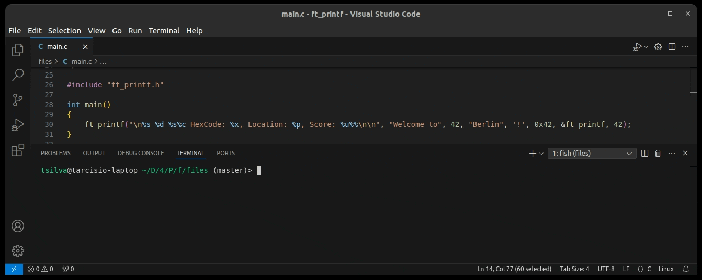

# 42 Berlin - Projects - ft_printf

`ft_printf` is a custom implementation of the standard `printf` function in C. It mimics the behavior of `printf`, allowing formatted output of various data types such as characters, strings, integers, and pointers. This project was created to deepen understanding of variadic functions and handling of different format specifiers in C.

## Table of Contents

- [Functionality](#functionality)
- [Supported Specifiers](#supported-specifiers)
- [Technologies Used](#technologies-used)
- [Key Learnings](#key-learnings)
- [References](#references)

## Functionality

The `ft_printf` function processes a format string that contains format specifiers (such as `%d`, `%s`, etc.), which dictate how the subsequent arguments should be formatted and printed. It returns the total number of characters printed. 

The function iterates through the format string and prints characters as they are, but when it encounters a `%` character, it expects a format specifier to follow. Depending on the specifier, it calls appropriate helper functions to print the corresponding argument.

## Supported Specifiers

The `ft_printf` function supports the following format specifiers:

| Specifier | Description |
|-----------|-------------|
| `%c`      | Prints a single character |
| `%s`      | Prints a string of characters |
| `%d`, `%i`| Prints an integer in decimal notation |
| `%x`      | Prints an unsigned integer in hexadecimal notation (lowercase) |
| `%X`      | Prints an unsigned integer in hexadecimal notation (uppercase) |
| `%p`      | Prints a pointer address in hexadecimal notation |
| `%u`      | Prints an unsigned integer in decimal notation |
| `%%`      | Prints a literal percent sign (`%`) |

### Explanation of Specifiers

- **`%c`**: Used to print a single character.
- **`%s`**: Outputs a string of characters. If the string is `NULL`, it prints `"(null)"`.
- **`%d`, `%i`**: Prints an integer in base 10. Handles both positive and negative numbers.
- **`%x`, `%X`**: Prints an unsigned integer in hexadecimal format, using lowercase (`x`) or uppercase (`X`) letters.
- **`%p`**: Prints a memory address (pointer) in hexadecimal notation, with a `0x` prefix.
- **`%u`**: Prints an unsigned integer in decimal format (base 10).
- **`%%`**: Prints the percent symbol `%` literally.

## Technologies Used

- **C Language**: The core logic of the program was implemented in C.
- **Variadic Functions**: The use of `va_list`, `va_start`, and `va_end` enables handling of a variable number of arguments passed to `ft_printf`.
- **Dynamic Memory Management**: Functions like `ft_itoa` are used to convert integers to strings, requiring memory allocation with `malloc` and deallocation with `free`.

## Key Learnings

Through the development of this program, several important C programming concepts were reinforced:

- **Variadic Functions**: The ability to process an arbitrary number of arguments is critical for implementing functions like `printf`. This required a solid understanding of `va_list` and how to extract and cast arguments dynamically.
- **Memory Management**: Properly allocating and freeing memory was essential, especially when handling dynamic strings (e.g., converting integers to strings). Avoiding memory leaks is crucial in C.
- **Recursion**: Recursive functions were used in `ft_print_h` for printing numbers in different bases, which highlights the power of recursion for breaking down problems.
- **String Handling**: Implementing the printing of different data types required a deep understanding of string manipulation in C, such as the use of `ft_strlen`, `ft_putstr_fd`, and dealing with `NULL` values.

## References

- [Variadic Functions in C](https://en.cppreference.com/w/c/variadic)
- [printf() Function Documentation](https://www.cplusplus.com/reference/cstdio/printf/)
- [Memory Management in C](https://www.cprogramming.com/tutorial/c/lesson6.html)
- [Working with Strings in C](https://www.tutorialspoint.com/c_standard_library/c_function_strlen.htm)
- [Hexadecimal Representation in C](https://www.geeksforgeeks.org/hexadecimal-in-c/)
    

   
_This project uses some functions of my personal **Libft**._ [_See the full Libft project here._](https://github.com/Tarcisio2code/42Berlin/tree/master/Projects/Libft)
