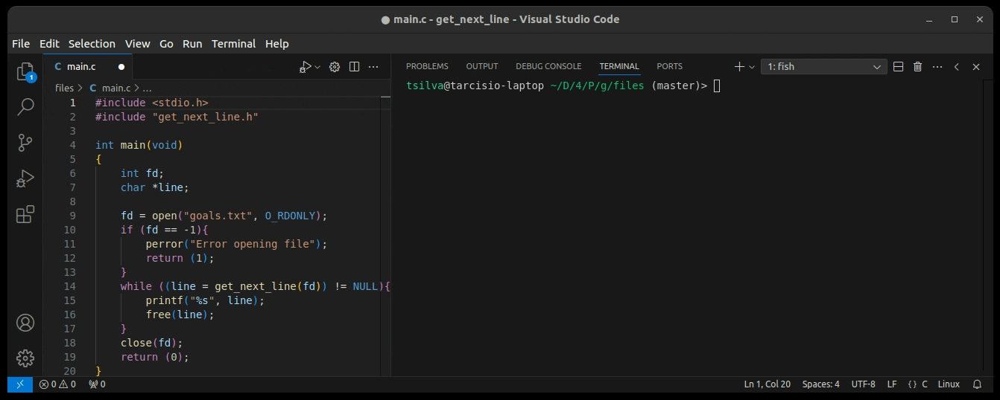

# 42 Berlin - Projects - Get Next Line

This project implements a function `get_next_line` that reads and returns one line at a time from a file descriptor. The function is useful in scenarios where it is necessary to process large files efficiently by reading line-by-line instead of loading the entire file into memory.

## Table of Contents
- [Function Explanation](#function-explanation)
- [Technologies Used](#technologies-used)
- [Key Learning Outcomes](#key-learning-outcomes)
- [References](#references)

## Function Explanation

The `get_next_line` function is designed to read a file descriptor (`fd`) and return the next line of text until the newline character (`\n`) or the end of the file is reached. The function behaves as follows:

- **Static Buffer**: It stores any leftover content between function calls to continue reading from where it last left off.
- **Dynamic Memory Allocation**: The function dynamically allocates memory for storing partial lines as the file is read, ensuring that memory is freed once no longer needed.
- **Error Handling**: Proper checks are in place to handle invalid file descriptors, memory allocation failures, and reading errors.

The main components of the function include:
- `get_next_line`: The primary function that manages reading the file descriptor and returning one line at a time.
- `clean_line`: A helper function that frees memory and returns either the full line or NULL in case of errors.
- `extract_next`: This function extracts the next complete line from the accumulated content and handles the memory allocation for the next portion of the file.
- `feth_line`: A utility function to concatenate new content read from the file into the accumulated line buffer.

## Technologies Used

This project uses the following key technologies and libraries:
- **C Programming Language**: Core logic of reading from file descriptors and dynamic memory management is implemented in C.
- **System Calls**: The `read()` system call is used to read from the file descriptor, and standard memory functions like `malloc()`, `free()`, and `memcpy()` are used for memory management.
- **Static Variables**: Used to maintain state between multiple calls to `get_next_line`.

## Key Learning Outcomes

During the development of this project, the following important concepts were learned and reinforced:

1. **File Descriptors**: Understanding how to open, read, and manage file descriptors in C, including handling edge cases and errors.
2. **Dynamic Memory Management**: Effectively using `malloc()`, `free()`, and ensuring that memory is managed properly to avoid memory leaks.
3. **Buffering and Static Variables**: Using buffers to read data efficiently and static variables to maintain state across multiple function calls.
4. **String Manipulation**: Developing robust methods to join, extract, and manipulate strings using custom functions (`ft_strjoin`, `ft_memcpy`) for performance and flexibility.

## References

Here is a list of references and documentation that provide additional information about key concepts used in this project:

1. [File Descriptors in Unix](https://en.wikipedia.org/wiki/File_descriptor) - Understanding file descriptors and how they work in Unix-based systems.
2. [Dynamic Memory Allocation in C](https://www.geeksforgeeks.org/dynamic-memory-allocation-in-c-using-malloc-calloc-free-and-realloc/) - A guide to `malloc()`, `calloc()`, and `free()` functions.
3. [read() system call](https://man7.org/linux/man-pages/man2/read.2.html) - Official documentation of the `read()` system call used to read data from file descriptors.
4. [Static Variables in C](https://www.tutorialspoint.com/cprogramming/c_static_variables.htm) - Explanation of static variables and their scope in C.
5. [String Manipulation in C](https://www.tutorialspoint.com/c_standard_library/c_function_strjoin.htm) - Example implementations and usage of string manipulation functions in C.
    

