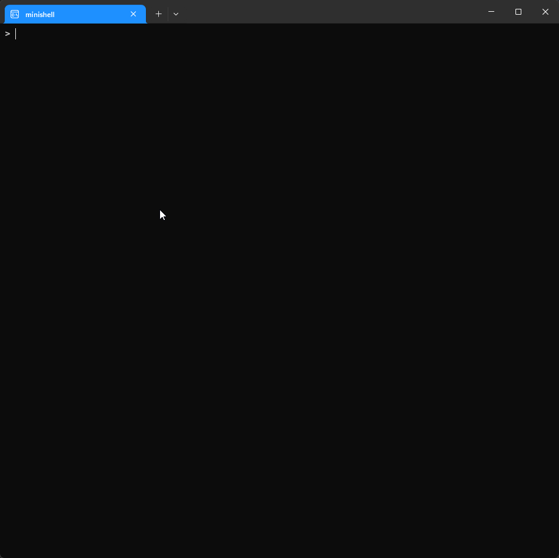

# 42 Berlin - Projects - Minishell


## 📖 Overview
**Minishell** is a simplified version of a shell, such as Bash, that has been written in C. The aim is to create a functional command-line interpreter that can handle processes, redirections, pipes and built-in commands while adhering to the `POSIX` system specifications.

## 📄 Summary
This project marks a significant milestone in the **42 curriculum** by introducing fundamental operating system concepts, including process creation (fork), inter-process communication (pipes), signal handling and file management via file descriptors. This project was built entirely in C, following strict memory management and coding standards.

## ✨ Key Features Learned
* **Tokenization & Parsing**: Transforming raw command lines into an execution tree or a list of commands.
* **Process Management**: Utilizing `fork`, `execve`, and `waitpid` to execute binaries and manage child processes.
* **Pipes & Redirections**: Implementing `|`, `>`, `<`, `>>`, and `<<` (here-doc) using `pipe` and `dup2`.
* **Built-ins commands**: Recreating internal commands such as `echo`, `cd`, `pwd`, `export`, `unset`, `env`, and `exit`.
* **Signal Handling**: Correctly managing `Ctrl+C`, `Ctrl+D`, and `Ctrl+\` to simulate Bash behavior.
* **Environment Variables**: Handling `$VAR` expansions and the `$?` exit status.
* **Error Handling**: Implementing comprehensive error messages and accurate exit codes to match standard shell behavior.
* **Interactive Prompt**: Displaying a dynamic and responsive prompt for a better user experience.
* **Memory Management**: Ensuring a leak-free implementation through rigorous testing and careful resource deallocation.
* **Performance**: Optimized parsing and execution logic to ensure minimal latency during command processing.

## 🧠 Technical Challenges
- **Robust Lexer & Parser:** Designing a system capable of accurately tokenizing and interpreting complex user input.
- **Quoting Logic:** Handling intricate edge cases involving single (`'`) and double (`"`) quotes, including nested scenarios.
- **Process Orchestration:** Managing the lifecycle of multiple concurrent processes when dealing with complex pipe chains.
- **Resource Integrity:** Preventing memory leaks and managing file descriptors across forks and redirections.
- **Heredoc Implementation:** Correctly replicating `<<` behavior, including temporary file management and signal interruptions.
- **Signal Emulation:** Precisely replicating bash-like behavior for interrupts and quits across different shell states.

## 🏗 Architecture
The project follows a strictly modular structure to ensure maintainability:
- **Lexer:** Responsible for scanning and tokenizing raw user input into meaningful components.
- **Parser:** Analyzes tokens to build structured command objects ready for execution.
- **Expander:** Handles the resolution of environment variables (`$VAR`) and quote removal.
- **Executor:** The core engine that manages processes, establishes pipes, and handles redirections.
- **Builtins Module:** A dedicated suite for internal command execution (e.g., `cd`, `export`, `exit`).
- **Signal Module:** Centralized handler for custom signal behavior throughout the shell's lifecycle.

## ⚙️ Important System Calls and Functions
**Process & Execution**
* **fork**: Creates a new child process.
* **execve**: Replaces the current process with a new program.
* **waitpid**: Waits for a child process to change state.
* **pipe**: Creates a unidirectional data channel for inter-process communication.
* **dup2**: Duplicates a file descriptor to redirect input/output.

**Readline Library**
* **readline**: Reads a line from the terminal with editing support.
* **add_history**: Adds the command to the input history.
* **rl_on_new_line**: Informs the library that we have moved to a new line (essential for signal handling).

## 📦 Custom Libraries
 - [`libft`](https://github.com/Tarcisio2code/42Berlin/tree/master/Projects/Libft) for utility functions.

## 🚀 Usage
1. Clone the repository:
   ```bash
   git clone https://github.com/tarcisio2code/42Berlin.git
   ```

2. Install Requirements for Linux
   - The `readline` development library is required for compilation.
   ```bash
   sudo apt update
   sudo apt install libreadline-dev 
   ```

3. Build the project:
   ```sh
   make
   ```

4. Run:
   ```sh
   ./minishell
   ```

## 🧪 Manual Testing Guide:
You can verify the behaviour of the shell by running these test cases and comparing the output with that of the original Bash.

### 🚩 Mandatory Suite (Parsing & Pipes)
_Check for correct tokenization and process piping:_
```bash
# Test multiple pipes and data flow.
ls -l | grep ".c" | wc -l
```

```bash
# Test Here-doc (input redirection) and pipe combination.
cat << EOF | grep "hello"
hello world
EOF
```

```bash
# Test complex quote nesting and literal string handling.
echo "Double quotes 'with single' inside"
echo 'Single quotes "with double" inside'
```

### 🛠️ Built-in Validation
_Verify that internal commands update the environment correctly_:
```bash
# Check directory navigation and path synchronization
cd .. && pwd
```

```bash
# Test environment variable assignment and expansion
export VAR=42
echo $VAR
```

```bash
# Test variable removal
unset VAR
echo $VAR
```

```bash
# Test exit status propagation to the parent shell
exit 42
# (After exit, run 'echo $?' in your terminal to verify)
```

### ⚡ Signal Stress Test
- Ensure the shell handles interruptions gracefully:

- **Prompt Resilience**: Press `Ctrl+C` at an empty prompt; it should move to a new line with a fresh prompt.

- **Signal Ignoring**: Press `Ctrl+\` at an empty prompt; nothing should happen (no "Quit" core dump).

- **Process Interruption**: Run `sleep 10`, then press `Enter` and press `Ctrl+C`; the process should terminate immediately.

- **EOF Handling**: Press `Ctrl+D` on an empty line to exit the shell cleanly.

### 💧 Leak Detection
_Monitor memory allocation and resource cleanup:_
```bash
# Run with Valgrind to ensure no memory is lost during command cycles
make check_leaks
```

```bash
# Inside the minishell, trigger allocations and check for clean exits
ls -l
export TEST=value
exit
```

## 🔬 References
- [Bash Reference Manual](https://www.gnu.org/software/bash/manual/)
- [GNU Readline Library Documentation](https://tiswww.cwru.edu/php/chet/readline/rltop.html)
- [Write Your Own Shell (Stephen Brennan)](https://brennan.io/2015/01/16/write-a-shell-in-c/)

## 🖥️ Runtime Demonstration
