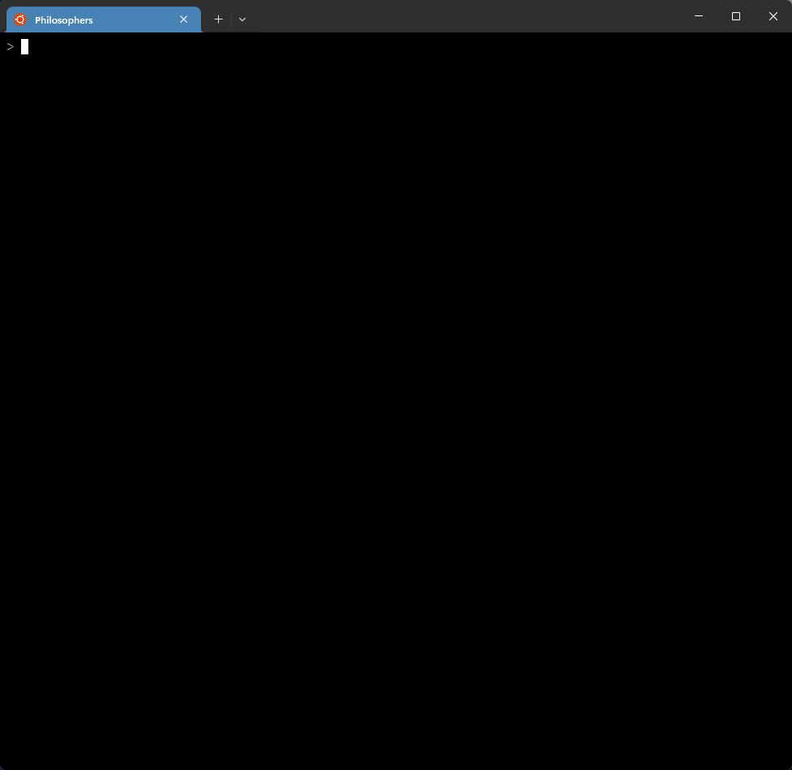

# 42 Berlin - Projects - Philosophers


## 📖 Overview

Philosophers is a high-performance simulation of the classic <b>Dining Philosophers Problem</b>, a cornerstone of concurrent computing. The goal is to design a robust system where multiple independent threads (philosophers) compete for shared resources (forks) without ever falling into a <b>deadlock</b> or suffering from <b>data races</b>.
</br></br>
<b>The Challenge:</b> Each philosopher must eat, sleep, and think. To eat, they need two forks. However, they only have access to the fork on their left and the one on their right. If all philosophers grab one fork at the same time, the system freezes (deadlock). My implementation solves this using a resource hierarchy and atomic state management.
</br></br>
<b>The Solution:</b>
My implementation utilizes a <b>Resource Hierarchy</b> (asymmetric fork picking) to break the circular wait and <b>Atomic Access</b> to shared data to prevent race conditions.
<br clear="all">

## ✨ Key Features Learned
- **Thread Management:** Creating, managing, and synchronizing multiple threads with `pthread_create` and `pthread_join`.

- **Mutex Synchronization:** Using `pthread_mutex_t` to prevent data races and ensure exclusive access to shared resources (forks and shared variables).

- **Race Condition Prevention:** Identifying and fixing scenarios where multiple threads attempt to modify the same data simultaneously.

- **Deadlock Avoidance:** Implementing resource hierarchy strategies (asymmetric fork picking) to break circular wait conditions.

- **Time Precision:** Implementing a high-precision `usleep` wrapper to maintain millisecond accuracy across the simulation.

- **Shared Memory State:** Managing a global state safely across threads using protected getters and setters.

- **Monitoring & Watchdog:** Developing a background monitor thread to track philosopher status and trigger termination if a death is detected.

- **Memory Integrity:** Ensuring a leak-free environment, even with dynamic allocation of thread-specific structures.

## 🧠 Technical Challenges
- **The Deadlock Trap:** Solving the scenario where every philosopher holds one fork and waits forever for the second.

- **Microsecond Precision:** Ensuring that a philosopher who is scheduled to die in 200 ms actually dies at that exact time despite any system scheduling delays.

- **Log Jumbling:** Preventing multiple threads from printing their status simultaneously, which would result in scrambled or out-of-order text logs.

- **Data Races:** Safeguarding sensitive variables like last_meal_time and dinner_over flag which are read by the monitor while being written by philosophers.

- **Thread Synchronization Barrier:** Ensuring all philosophers start their routine at the exact same time to maintain a fair simulation.

## 🏗 Architecture
The project is built with a safe, modular infrastructure:

- **Initialization:** Memory allocation for forks and philosophers, and setup of all synchronization mutexes.

- **Philo Routine:** The main lifecycle loop (Eat -> Sleep -> Think) executed by each philosopher thread.

- **Monitor (Watcher):** A high-priority thread that continuously sweeps all philosophers to check for starvation or satiety.

- **Wrappers Layer:** A centralized system for thread and mutex operations to handle error codes and keep logic clean.

- **Time Utility:** A robust timing module based on `gettimeofday` to track simulation progress in milliseconds.

## ⚙️ Important System Calls and Functions
**Threads & Mutexes**

- **pthread_create:** Spawns a new thread for a philosopher or the monitor.

- **pthread_join:** Synchronizes the main process with the completion of the simulation threads.

- **pthread_mutex_init/destroy:** Manages the lifecycle of synchronization primitives.

- **pthread_mutex_lock/unlock:** Ensures atomic access to shared resources.

**Time Management**

- **gettimeofday:** Retrieves the current time with microsecond resolution.

- **usleep:** Suspends thread execution (used within a loop for higher precision).

## 🚀 Usage
1. Clone the repository:
    ```Bash
    git clone https://github.com/tarcisio2code/42Berlin.git
    ```

2. Build the project:
    ```Bash
    cd philosophers
    make
    ```

3. Run the simulation:
    ```Bash
    # Format: ./philo number_of_philosophers time_to_die time_to_eat time_to_sleep [number_of_times_each_philosopher_must_eat]
    ./philo 5 800 200 200
    ```
    🧾 Arguments
    | Argument                                    | Description                                                             |
    | ------------------------------------------- | ----------------------------------------------------------------------- |
    | `number_of_philosophers`                    | Number of philosophers (and forks)                                      |
    | `time_to_die`                               | Time (ms) before a philosopher dies if not eating                       |
    | `time_to_eat`                               | Time (ms) spent eating                                                  |
    | `time_to_sleep`                             | Time (ms) spent sleeping                                                |
    | `number_of_times_each_philosopher_must_eat` | *(Optional)* Simulation stops when all philosophers eat this many times |

## 🧪 Simulation Test Cases:
Use these cases to verify the robustness of your implementation:

### 🚩 Death Scenarios
_The philosopher should die exactly as specified:_

```Bash
# Philosopher should die of hunger
./philo 1 800 200 200
```

```Bash
# Philosophers should not eat and eventually die
./philo 4 310 200 100
```

### 🛠️ Stability Validation
_The simulation should run indefinitely or until the meal count is reached:_

```Bash
# No one should die
./philo 5 800 200 200
```

```Bash
# Simulation should stop after everyone eats 7 times
./philo 5 800 200 200 7
```

### ⚡ Stress Test
_Verify performance and synchronization under heavy load:_

```Bash
# Testing with 200 philosophers (max limit)
./philo 200 800 200 200
```

### 💧 Leak & Race Detection
_Ensuring the simulation is safe and clean_:

```Bash
# Check for memory leaks
valgrind --leak-check=full ./philo 5 800 200 200
```

```Bash
# Check for data races (recompile with -fsanitize=thread)
make race && timeout 5s ./philo 5 800 200 200
```

## 🔬 References
- [Dining Philosophers Problem - Wikipedia](https://en.wikipedia.org/wiki/Dining_philosophers_problem)
- [Pthreads - Linux manual page](https://man7.org/linux/man-pages/man7/pthreads.7.html)
- [Mutexes and Condition Variables](https://www.gnu.org/software/guile/manual/html_node/Mutexes-and-Condition-Variables.html)
- [📗 Programming with POSIX Threads – David R. Butenhof](https://ptgmedia.pearsoncmg.com/images/9780201633924/samplepages/0201633922.pdf)


## 🖥️ Runtime Demonstration
⚠️ _The simulatios below use Linux commands `sed`, `awk`, `grep`, and `tail` to filter logs for precise verification._    

<details open>
    <summary><strong>Memory Integrity & Resource Deallocation</strong></summary>

* ✅ **Stress Test:** Managed `100` high-concurrency threads with zero memory leaks.
* ✅ **Resource Audit:** Verified via `Valgrind` that all mutexes were destroyed and heap blocks freed.
* ✅ **Lifecycle Validation:** Confirmed full initialization and cleanup of the 100th philosopher thread.    

    
</details>

<details>
    <summary><strong>Race Condition Verification</strong></summary>

* ✅ **Thread Sanitizer Compilation:** System successfully compiled using `-fsanitize=thread` and -g flags for runtime analysis.
* ✅ **Automated Stress Test:** Simulation executed for 5s using the timeout command to guarantee stress conditions.
* ✅ **Data Race Validation:** Final 10 lines of the log verified to contain zero thread collision reports.    

    
</details>

<details>
    <summary><strong>High-Concurrency Stress Test & Synchronization Audit</strong></summary>

* ✅ **Deterministic Scheduling:** Validated using `4 410 200 200` parameters.
* ✅ **Starvation-Free Logic:** Even and odd-numbered threads alternating execution cycles.
* ✅ **Synchronized Coordination:** Confirmed precise 200ms intervals between state transitions.
* ✅ **Simultaneous Resource Access:** Validated using `5 800 200 200 3` parameters.
* ✅ **Non-Blocking Design:** Multiple threads acquiring mutexes at identical timestamps.
* ✅ **Optimal Resource Handoff:** Near-zero latency between fork release and subsequent acquisition.

    
</details>


<details>
    <summary><strong>Long-Term Stability & Monitor Precision Benchmarks</strong></summary>

* ✅ **Equal Meal Distribution:** Validated using `5 800 200 200 7` parameters.
* ✅ **Fair Scheduling:** All threads reached the exact 7-meal threshold.
* ✅ **Stability Check:** No starvation detected under critical timing margins.
* ✅ **Monitor Precision:** Validated using `1 800 200 200` parameters.
* ✅ **Death Watchdog:** Thread state transition to died triggered at the exact limit.
* ✅ **Hardware Accuracy:** Process terminated precisely at the 800ms threshold.

    
</details>