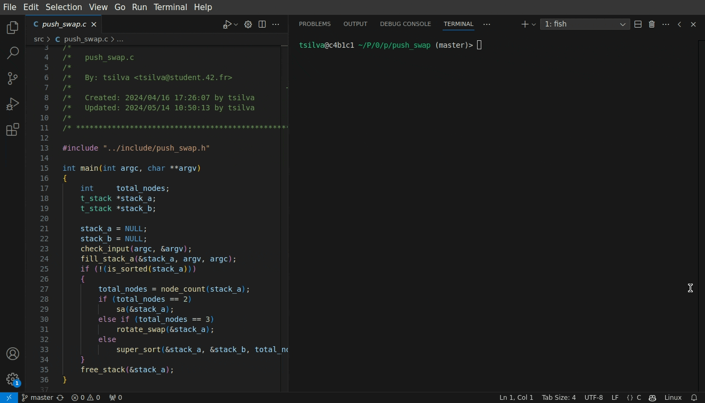
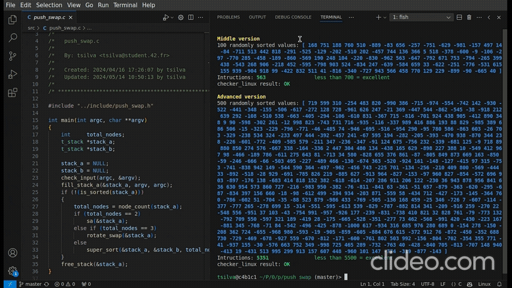

# 42 Berlin - Projects - Push_Swap

## Overview
The `push_swap` program is designed to sort a stack of integers using a limited set of operations. The goal is to sort the stack with the minimum number of operations. The program uses two stacks (A and B) and provides various operations to manipulate these stacks.

## Summary
Push Swap leverages several standard libraries and custom functions to perform stack operations and sorting. The key technologies and libraries used include:
- **Standard Libraries**: `stdlib.h`, `stdbool.h`, `limits.h`
- **Custom Library**: [`libft`](https://github.com/Tarcisio2code/42Berlin/tree/master/Projects/Libft) for utility functions
- **Data Structures**: Doubly linked list for stack representation

## Key Features Learned
- **Data Structures**: Implementation and manipulation of doubly linked lists.
- **Algorithm Design**: Designing and implementing efficient sorting algorithms.
- **Memory Management**: Proper allocation and deallocation of memory to avoid leaks.
- **Error Handling**: Ensuring robust error handling and resource cleanup.

## The Mechanical Turk Algorithm
The Mechanical Turk algorithm is used in this program to optimize the sorting process. It works by identifying the "cheapest" move at each step, which minimizes the total number of operations required to sort the stack.
The use of the Mechanical Turk algorithm helps in reducing the total number of operations, thereby improving the performance of the program.

### How It Works
1. **Node Positioning**: Each node in the stack is assigned a position and a cost to move it to its target position.
2. **Cost Calculation**: The cost is calculated based on the number of operations required to move the node to its target position.
3. **Cheapest Move**: The node with the lowest cost is identified as the "cheapest" move.
4. **Execution**: The program performs the move and updates the stack accordingly.

## Key Functions
- `set_node_pos` : Sets the position and middle flags for each node in the stack.
- `set_node_price` : Calculates the cost of moving each node.
- `set_cheap_node` : Marks the node with the lowest move cost as the cheapest.
- `push_to_stack` : Pushes nodes between stacks based on the calculated costs.
- `super_sort`: Main sorting function that coordinates the entire sorting process.
- `push_to_stack`: Moves the cheapest element from stack A to stack B.
- `move_to_top`: Moves a specific node to the top of the stack.
- `rotate_swap`: Performs rotations and swaps to optimize the position of nodes.

## Important System Calls and Functions
Here are some key system functions and important C functions used in Push Swap:

1. **malloc()**: Allocates memory dynamically.
   - [malloc in C](https://man7.org/linux/man-pages/man3/malloc.3.html)

2. **free()**: Deallocates previously allocated memory.
   - [free in C](https://man7.org/linux/man-pages/man3/free.3.html)

3. **write()**: Writes data to a file descriptor.
   - [write in Unix](https://man7.org/linux/man-pages/man2/write.2.html)

## Usage
The Push Swap program is executed as follows:

```sh
./push_swap [numbers...]
```

For example:
```sh
./push_swap 3 2 5 1 4
```

This command will sort the numbers `3, 2, 5, 1, 4` using the minimum number of operations.

## References
- [Man Pages for Linux System Calls](https://man7.org/linux/man-pages/)
- [stdlib.h - Standard library for utility functions, including memory allocation](https://en.cppreference.com/w/c/memory)
- [string.h - Standard library for string manipulation](https://en.cppreference.com/w/c/string/byte)
- [Stack Operations - Swap](https://en.wikipedia.org/wiki/Swap_(computer_science))
- [Stack Operations - Push](https://en.wikipedia.org/wiki/Stack_(abstract_data_type))
- [Stack Operations - Rotate](https://en.wikipedia.org/wiki/Rotation_(computer_science))
- [Sorting Algorithms](https://en.wikipedia.org/wiki/Sorting_algorithm)
- [The Mechanical Turk Algorithm](https://en.wikipedia.org/wiki/Mechanical_Turk)

<br />
<hr/>
<br />


    
[_Push Swap Visualizer by o-reo_](https://github.com/o-reo/push_swap_visualizer)


