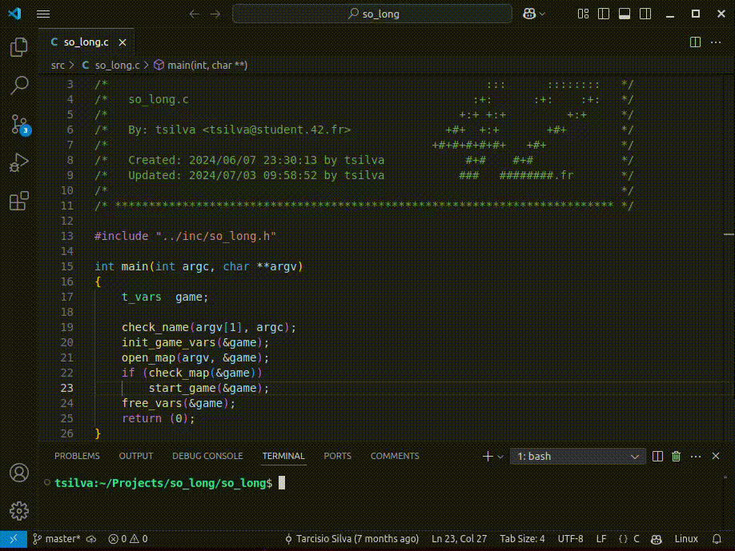
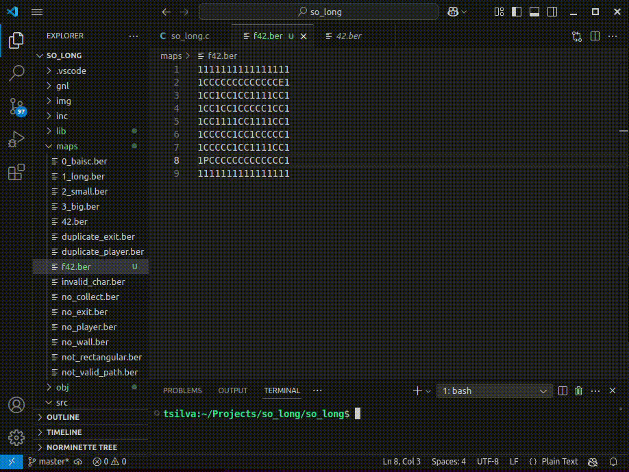
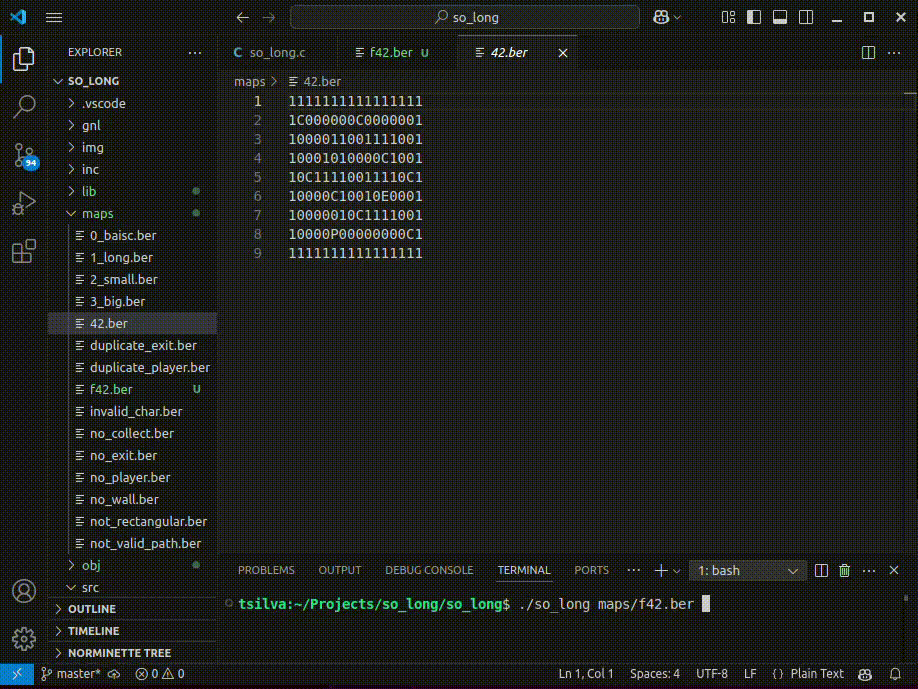

# 42 Berlin - Projects - 🕹️ So Long


## 📖 Overview
A charming 2D top-down game built from scratch using the MiniLibX. The game involves navigating a player through a map to collect items and reach an exit.

## Summary
The So_Long project demonstrates the use of the MLX library to create a graphical application. It covers essential concepts such as window creation, image rendering, event handling, and game logic implementation.

## ✨ Key Features Learned
- Initializing and using the MLX library for graphical applications.
- Loading and displaying images in a window.
- Handling keyboard and mouse events.
- Implementing game logic and rendering updates.
- Managing memory and resources efficiently.
- Robust validation for map files and assets.

## Important System Calls and Functions
### MiniLibX Functions
- `mlx_init`: Initializes the connection to the X server.
- `mlx_new_window`: Creates a new window.
- `mlx_new_image`: Creates a new image.
- `mlx_xpm_file_to_image`: Loads an XPM image file.
- `mlx_put_image_to_window`: Displays an image in a window.
- `mlx_hook`: Sets up event hooks for the window.
- `mlx_loop`: Starts the event loop.
- `mlx_destroy_window`: Destroys a window.
- `mlx_destroy_image`: Destroys an image.

## Custom Libraries
 - [`libft`](https://github.com/Tarcisio2code/42Berlin/tree/master/Projects/Libft) for utility functions.

## Custom Funcitons
-  [`Get Next Line`](https://github.com/Tarcisio2code/42Berlin/tree/master/Projects/get_next_line) to read a line from a file descriptor.

## Usage
1. Clone the repository:

2. Install Requirements for Linux
   - X11 include files (package xorg)
   - XShm extension must be present (package libxext-dev)
   - Utility functions from BSD systems - development files (package libbsd-dev)
   ```sh
   sudo apt update
   sudo apt install xorg libxext-dev libbsd-dev
   ```

3. Build the project:
   ```sh
   make
   ```

4. Run the game:
   ```sh
   ./so_long maps/42.ber
   ```

## 🎮 Controls 
      W / ↑    Move Up
      S / ↓    Move Down
      A / ←    Move Left
      D / →    Move Right
      ESC      Close Game

## References
- [MiniLibX Documentation](https://harm-smits.github.io/42docs/libs/minilibx)
- [Minilibx-linux](https://github.com/42Paris/minilibx-linux)
- [X Window System](https://en.wikipedia.org/wiki/X_Window_System)

## So Long Gameplay Preview

_**Compile and play**_    
>    

_**Checking for inconsistencies on the map**_   


_**Playing another map layout**_   


## 💖 Special Thanks
_For this project, I had the special support of my 14-year-old daughter. She created the entire theme based on her hamster, including the main character and all the assets used in the game. In other words, I only did the "easy" part! :smiley:_